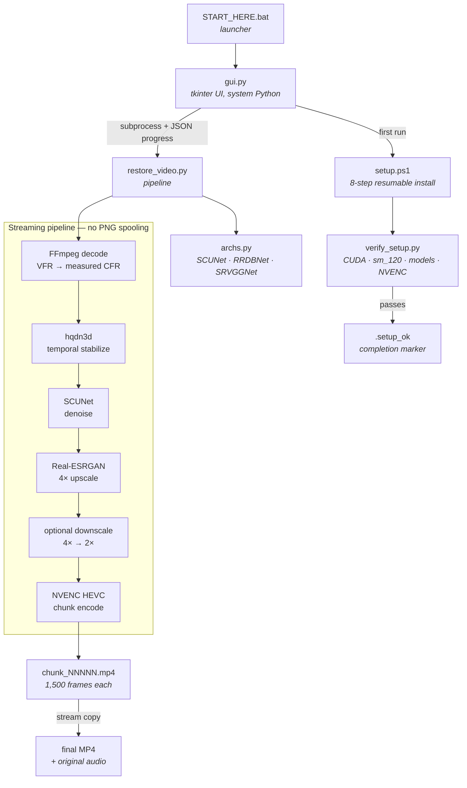

<div align="center">

# ◆ RestoreForge AI

**Local AI Video Restoration for Windows**

[](https://github.com/Aryansingh0783/restoreforge-ai/actions/workflows/ci.yml)
[](LICENSE)

Denoise and upscale noisy, low-quality footage on your own NVIDIA GPU.
Your video never leaves your computer — no uploads, no accounts, no cloud.

**[restoreforge-ai.vercel.app](https://restoreforge-ai.vercel.app)** — documentation and product site

[Features](#features) · [Requirements](#system-requirements) · [Quick start](#quick-start) ·
[Architecture](#architecture) · [Limitations](#honest-limitations) · [Contributing](CONTRIBUTING.md)

</div>

---

## What it does

RestoreForge AI restores heavily compressed, noisy video — webcam captures, old
recordings, low-light footage — using a five-stage GPU pipeline:

```
FFmpeg decode → Temporal stabilization → SCUNet denoise → Real-ESRGAN 4× → NVENC encode
```

It is built for the reality of the job: a full-length restoration runs for hours,
so the engine is chunked, resumable, and honest about how long it will take.

## Screenshots

> **Note:** these are placeholders. Real captures have not been taken yet — see
> [Remaining work](#remaining-work).

| | |
| --- | --- |
|  |  |
| *Restore — source details, settings and live progress* | *Environment — GPU, CUDA and model readiness* |
|  |  |
| *Activity log — everything the engine reports* | *Documentation website* |

## Features

- **Resumable chunk processing** — work splits into 1,500-frame chunks, each an
  independently playable MP4. An interruption costs at most one chunk.
- **Safe stop** — stopping finishes the chunk in flight, keeping the resume
  point frame-exact. Closing the window is equally safe.
- **Original audio preserved** — muxed into the final file by stream copy.
- **Colour-aware** — full-range sources detected and preserved. Forcing limited
  range on a full-range source measurably darkens the whole video.
- **VFR handling** — variable frame rate converted at the *measured* average, so
  no real frame is dropped and audio stays in sync.
- **Feathered tiling** — tiles blended with a ramp, verified to reconstruct the
  input to floating-point exactness at every tile size.
- **Encoder pre-flight** — the exact NVENC command is tested against a two-frame
  dummy encode before a long run, falling back through four option tiers and
  finally to CPU encoding.
- **Blackwell ready** — verifies your PyTorch build carries kernels for your GPU
  architecture, not merely that CUDA reports itself available.
- **Measured estimates** — runs 120 frames on your machine and projects the real
  duration before you commit.

## System requirements

| | |
| --- | --- |
| **OS** | Windows 10 or 11, 64-bit |
| **GPU** | NVIDIA with CUDA support (6 GB VRAM minimum, 8 GB+ comfortable) |
| **Python** | 3.11, with tcl/tk and IDLE |
| **FFmpeg** | On PATH, NVENC build recommended |
| **Disk** | ~5 GB for the environment and weights, plus scratch space per job |
| **Reference machine** | RTX 5070 12 GB (Blackwell, sm_120), Ryzen 7 9800X3D, 32 GB DDR5 |

**Not supported:** AMD and Intel Arc GPUs, Apple Silicon, Linux, macOS, CPU-only
machines. The pipeline depends on CUDA for inference and NVENC for encoding.

## Quick start

```powershell
winget install Python.Python.3.11    # keep "tcl/tk and IDLE" ticked
winget install Gyan.FFmpeg
```

Then, in the project folder:

1. Double-click **`START_HERE.bat`** — the application window opens.
2. Press **Install / Repair environment** (~2.5 GB PyTorch, ~10 minutes,
   resumable if the download drops).
3. Press **Check setup** (F5) — you want `ALL CHECKS PASSED`.
4. Choose a source video, press **Estimate time** to measure your real speed.
5. Press **Test 30 seconds** and watch the result.
6. Press **Start restoration**.

Command line, if you prefer:

```powershell
.\venv\Scripts\python.exe verify_setup.py
.\venv\Scripts\python.exe restore_video.py "input.mp4" --final-scale 2 --work D:\scratch
.\venv\Scripts\python.exe restore_video.py --help
```

### Choosing a scale

Use **2×** unless you have a reason not to. Both settings run the AI at 4×; 2×
then downsamples. The GPU work is identical, so **2× is not faster** — it is a
quality choice. Supersampling averages away detail the model invented, usually
giving a cleaner picture than native 4× at a quarter of the file size and with
far better playback compatibility. See the [quality guide](docs/quality-guide.md).

## Honest limitations

- **A full end-to-end production run has not yet been completed.** The pipeline,
  resume behaviour and encoder validation are covered by automated tests, and
  every stage has run on real footage, but long-run results are not published.
- **The desktop UI has not been visually reviewed on a physical display.** Its
  logic and construction are tested; its rendered appearance is not.
- **Lost detail cannot be recovered.** AI upscaling invents plausible detail
  rather than retrieving what was never recorded. Faces and text are where that
  is most visible.
- **No guarantee for any given source.** Some damage will remain visible or be
  emphasised. Always judge a 30-second test before committing hours.
- **It is slow.** Roughly 2.2 s per 720p source frame on the reference GPU —
  about a day for a 41-minute clip. Never real time.
- **Other CUDA GPUs are untested.** Expected to work, not individually verified.

## Architecture



The GUI runs on the **system** Python because it must work before the virtual
environment exists — installing that environment is one of its jobs. The engine
runs in `venv/` and reports progress back over stdout as JSON lines.

## Project structure

```
.
├── START_HERE.bat          Double-click launcher (CRLF required)
├── gui.py                  Desktop interface — stdlib + tkinter only
├── config.py               Portable paths, settings, estimates
├── restore_video.py        Restoration engine
├── archs.py                SCUNet, RRDBNet, SRVGGNetCompact — no basicsr
├── setup.ps1               Resumable 8-step installer
├── verify_setup.py         CUDA, sm_120, model and NVENC verification
├── _test_pipeline.py       30 checks, no GPU needed
├── _test_gui.py            54 checks, no display needed
├── docs/                   Markdown documentation and screenshots
├── web/                    Next.js website (deploy this to Vercel)
├── models/                 Weights, downloaded by setup (git-ignored)
└── venv/                   Virtual environment (git-ignored)
```

## Tests

Both suites run without a GPU and without a display.

```powershell
.\venv\Scripts\python.exe _test_pipeline.py   # 30 checks — needs ffmpeg
.\venv\Scripts\python.exe _test_gui.py        # 54 checks
```

They cover frame-exact chunk seams, pixel-identical resume across an
interruption, safe-stop finalisation, A/V drift across chunk joins, tile
blending exactness, encoder option validity at every tier, and the whole GUI
construction and rendering path.

The test doubles deliberately model real behaviour — tkinter's internal
attributes, PyTorch's inference-tensor rules, PowerShell's stderr semantics —
because permissive stubs let three real bugs through during development.

## Website

The `web/` directory is a static Next.js site: product pages, documentation and
a client-side planning estimator. It never touches the Python pipeline and
cannot process video.

```bash
cd web
npm install
npm run dev      # http://localhost:3000
npm run lint
npm run typecheck
npm run build
```

### Deploying to Vercel

1. Push this repository to GitHub.
2. In Vercel, **Add New → Project** and import the repository.
3. Set **Root Directory** to `web`.
4. Confirm the framework is detected as **Next.js**. No environment variables
   are needed.
5. Deploy.
6. Add the resulting URL to this README.

> **Production URL:** <https://restoreforge-ai.vercel.app>

`GITHUB_OWNER` and `GITHUB_REPO` in [`web/src/lib/site.ts`](web/src/lib/site.ts)
are already set to this repository. Every outbound link derives from those two
values, so a fork needs exactly one edit.

## Security and privacy

Processing is entirely local. The application has no network listener, no
telemetry, no accounts and no analytics. The only outbound requests are during
setup: PyTorch from the official wheel index and PyPI, and model weights from
their upstream GitHub release URLs. After setup, restorations run fully offline.

Model weights are `.pth` files, and PyTorch checkpoints can execute code when
loaded — always let setup fetch them from the official URLs rather than sourcing
them elsewhere. See [SECURITY.md](SECURITY.md).

## Contributing

See [CONTRIBUTING.md](CONTRIBUTING.md). It includes a table of previously fixed
bugs that must not be reintroduced, each with the reasoning behind it.

By participating you agree to the [Code of Conduct](CODE_OF_CONDUCT.md).

## Remaining work

- [ ] Capture real screenshots to replace the placeholders in `docs/screenshots/`
- [ ] Complete and document a full end-to-end restoration run
- [ ] Visually review the desktop UI on a physical display
- [x] Set the repository URLs in `web/src/lib/site.ts`
- [ ] Create the first GitHub Release
- [x] Deploy the website and record the URL above

## License

[MIT](LICENSE). Model weights carry their own licences — SCUNet is Apache-2.0
and Real-ESRGAN is BSD-3-Clause. Neither is distributed with this source; both
are downloaded at setup time.

## Acknowledgements

- [SCUNet](https://github.com/cszn/SCUNet) — Swin-Conv-UNet denoising
- [Real-ESRGAN](https://github.com/xinntao/Real-ESRGAN) — practical super-resolution
- [FFmpeg](https://ffmpeg.org/) — decoding, filtering and encoding
- [PyTorch](https://pytorch.org/) — inference
